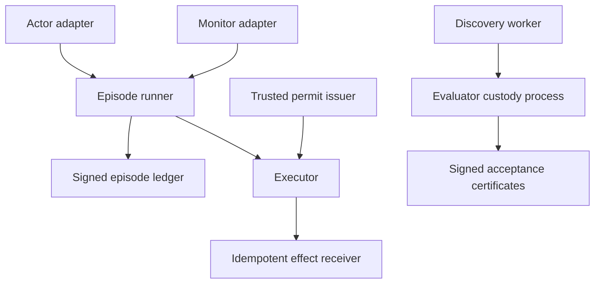

# Architecture

The actor proposes JSON actions. The runner records every decision and monitor response before applying it. The executor accepts consequential actions only with a state-bound permit. The discovery worker receives signed public task manifests; the evaluator-custody process retains task generation and certification authority.

This diagram is an interface map, not a deployment claim. The concrete trust assumptions are in the [threat model](threat-model.md).
